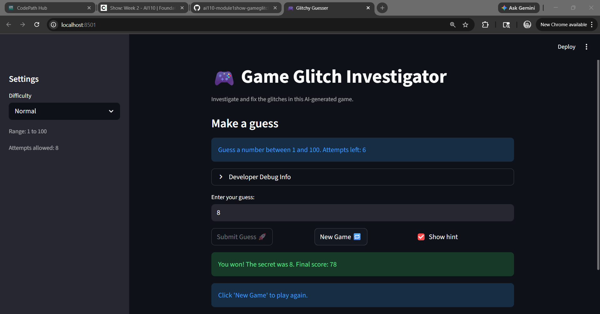
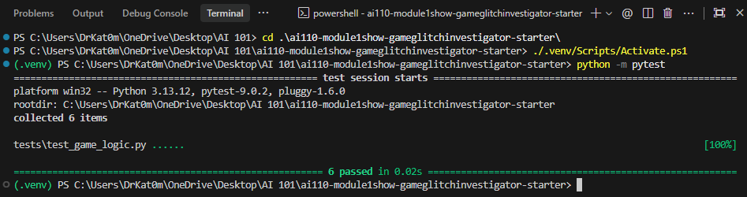

# 🎮 Game Glitch Investigator: The Impossible Guesser

## 🚨 The Situation

You asked an AI to build a simple "Number Guessing Game" using Streamlit.
It wrote the code, ran away, and now the game is unplayable. 

- You can't win.
- The hints lie to you.
- The secret number seems to have commitment issues.

## 🛠️ Setup

1. Install dependencies: `pip install -r requirements.txt`
2. Run the broken app: `python -m streamlit run app.py`

## 🕵️‍♂️ Your Mission

1. **Play the game.** Open the "Developer Debug Info" tab in the app to see the secret number. Try to win.
2. **Find the State Bug.** Why does the secret number change every time you click "Submit"? Ask ChatGPT: *"How do I keep a variable from resetting in Streamlit when I click a button?"*
3. **Fix the Logic.** The hints ("Higher/Lower") are wrong. Fix them.
4. **Refactor & Test.** - Move the logic into `logic_utils.py`.
   - Run `pytest` in your terminal.
   - Keep fixing until all tests pass!

## 📝 Document Your Experience

- [x] **Describe the game's purpose:** The "Impossible Guesser" is a number guessing game where the player tries to guess a secret number within a certain number of attempts, with hints provided along the way.
- [x] **Detail which bugs you found:**
    1. **Secret Number Instability:** The secret number changed every time the user submitted a guess or interacted with the UI.
    2. **Incorrect Hints:** The "Higher/Lower" hints were backwards or logically flawed.
    3. **UI/Logic Mixing:** Core game logic was mixed with Streamlit UI code, making it hard to test.
- [x] **Explain what fixes you applied:**
    1. **Session State:** Used `st.session_state` to store the secret number and attempts so they persist across reruns.
    2. **Logic Refactoring:** Moved all game logic (`check_guess`, `parse_guess`, etc.) into `logic_utils.py`.
    3. **Automated Testing:** Added `pytest` cases to verify the logic in isolation.

## 📸 Demo

- [x] **Challenge 1: Advanced Edge-Case Testing:** Passed 6 tests covering win conditions, hints, and input validation failures.

---

## 🚀 Stretch Features

- [x] **Challenge 1: Advanced Edge-Case Testing** - Implemented robust tests for invalid numbers and empty strings.
